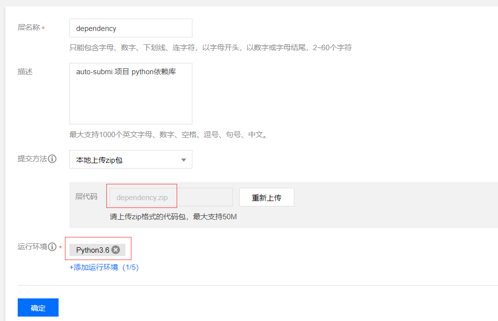
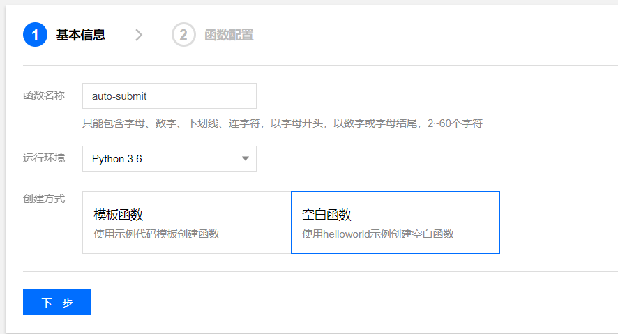
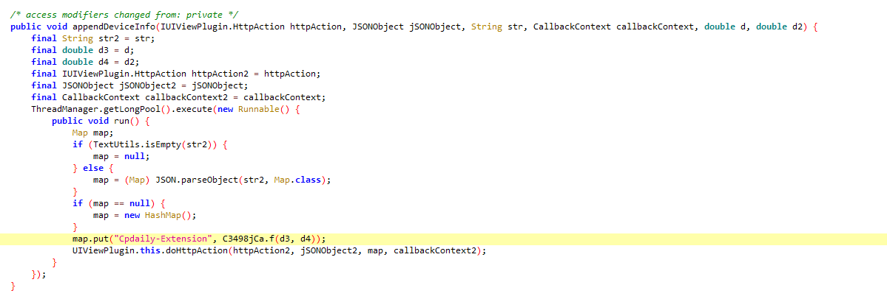
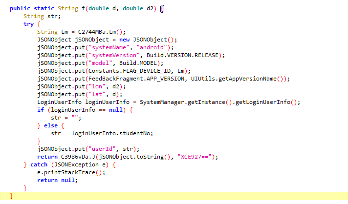

# auto-submit

#### 今日校园每日自动提交疫情上报py脚本，支持邮件推送提交结果消息，支持几乎所有学校

#### 使用了此脚本或者参考了这个项目，请自觉给项目点个star

#### 本项目仅供学习交流使用，如作他用所承受的任何直接、间接法律责任一概与作者无关

#### 如果此项目侵犯了您或者您公司的权益，请立即联系我删除

# 项目说明

- `config.yml` 配置文件
- `index.py` 完成自动提交的py脚本
- `A.py` 测试模拟登陆API是否适用于xx学校的py脚本
- `generate.py` 帮助生成默认项配置的py脚本
- `requirment.txt` py依赖库以及版本说明文件
- `dependency.zip` 打包好的云函数依赖库文件

# 使用方式

## 宜宾学院的同学
   
### 配合腾讯云函数使用（免费）

1. clone 或者 下载 此仓库到本地
    ```shell script
    git clone https://github.com/ZimoLoveShuang/auto-submit.git
    ```
2. 打开本地仓库文件夹，配置`config.yml`中对应的学号（username）和密码（password）还有地址（address）等等信息，详情请看`config.yml`中的注释说明，**注意这里的学号和密码都是智慧校园的学号和密码**
3. 打开百度搜索[腾讯云函数](https://console.cloud.tencent.com/scf/index?rid=1)，注册认证后，进入控制台，点击左边的层，然后点新建，名称随意，然后点击上传zip，选择项目中的`dependency.zip`上传，然后选择运行环境`python3.6`，然后点击确定，耐心等待一下，上传依赖包需要花费的时间比较长

4. 点左边的函数服务，新建云函数，名称随意，运行环境选择`python3.6`，创建方式选择空白函数，然后点击下一步

5. 提交方法选择在线编辑，把本地修改好的`index.py`直接全文复制粘贴到云函数的`index.py`，然后点击文件->新建，文件名命名为`config.yml`，然后把本地配置好的`config.yml`文件中的内容直接全文复制粘贴到云函数的`config.yml`文件，点击下面的高级设置，设置超时时间为`60秒`，添加层为刚刚新建的函数依赖层，然后点击完成

6. 进入新建好的云函数，左边点击触发管理，点击创建触发器，名称随意，触发周期选择自定义，然后配置cron表达式，下面的表达式表示每天中午十二点整执行
    ```shell script
   0 0 12 * * * *
    ```
7. 然后就可以测试云函数了，绿色代表云函数执行成功，红色代表云函数执行失败（失败的原因大部分是由于依赖造成的）。返回结果是`auto submit fail.`代表自动提交失败；返回结果是`auto submit success.`，代表自动提交成功，如遇到问题，请仔细查看日志
8. enjoy it!
9. 也可配合Windows计划任务或者使用linux定时任务，将脚本挂在自己的云服务器上，不会就搜索一下，过程不再赘述

#### 如果你不会配置表单组默认选项配置，请先配置好`user`信息之后执行`generate.py`然后将分割线下的内容复制到配置文件中对应位置

## 其他学校的同学

使用方式同宜宾学院同学，但请注意修改`index.py`中23行

#### 目前通过测试的学校

<table>
    <thead>
        <tr>
            <th>学校名称</th>
            <th>学校英文简称</th>
            <th>加入今日校园的方式</th>
        </tr>
    </thead>
    <tbody>
        <tr>
            <td>宜宾学院</td>
            <td>yibinu</td>
            <td>NOTCLOUD</td>
        </tr>
        <tr>
            <td>安徽农业大学经济技术学院</td>
            <td>jjjs</td>
            <td>CLOUD</td>
        </tr>
        <tr>
            <td>中国矿业大学</td>
            <td>cumt</td>
            <td>NOTCLOUD</td>
        </tr>
        <tr>
            <td>惠州市技师学院</td>
            <td>hzti</td>
            <td>CLOUD</td>
        </tr>
        <tr>
            <td>西南大学</td>
            <td>swu</td>
            <td>NOTCLOUD</td>
        </tr>
        <tr>
            <td>长江师范学院</td>
            <td>yznu</td>
            <td>NOTCLOUD</td>
        </tr>
        <tr>
            <td>新乡医学院</td>
            <td>xxmu</td>
            <td>CLOUD</td>
        </tr>
        <tr>
            <td>天津天狮学院</td>
            <td>tianshi</td>
            <td>CLOUD</td>
        </tr>
    </tbody>
</table>

#### 目前不支持的学校

<table>
    <thead>
        <tr>
            <th>学校名称</th>
            <th>不支持原因</th>
            <th>加入今日校园的方式</th>
        </tr>
    </thead>
    <tbody>
        <tr>
            <td>福州大学</td>
            <td>学生账号今日校园云端系统被禁用</td>
            <td>NOTCLOUD</td>
        </tr>
    </tbody>
</table>

##### 正在考虑写一个模拟原生登陆cloud和notcloud的脚本

# 说明

1. 此项目**默认配置适用于宜宾学院学子，也欢迎其他学校同学提交适合自己学校的配置**，命名为`config_学校英文简称.yml`，示例：`config_hzti.yml`，hzti是惠州市技师学院的英文简称，不需要<s>抓包</s>
2. 此项目依赖`python3.8`运行环境，如没有，自行安装
3. 此项目依赖`PyYAML oss2 urllib requests json `等python库，如没有，自行安装，**参考命令**
    ```shell script
    pip install -r requirement.txt -t . -i https://mirrors.aliyun.com/pypi/simple
    ```
4. 此项目依赖上一个爬虫项目[宜宾学院教务系统成绩爬虫](https://github.com/ZimoLoveShuang/yibinu-score-crawler.git)，开放的登陆api
5. 此项目默认提交全部正常的情况，如果有其他情况，请自行在今日校园app上提交

# 设计思路

1. 模拟登陆
2. 获取表单
3. 填充表单
4. 提交表单
5. 推送消息

# 关于模拟登陆API的说明

请看[`wisedu-unified-login-api`项目](https://github.com/ZimoLoveShuang/wisedu-unified-login-api.git)

# 关于金智教务系统的说明

1. 学校接入金智系统的方式有两种：`CLOUD`和`NOTCLOUD`
2. `CLOUD`方式对应的教务系统登陆页通常以`/iap/login`结尾
3. `NOTCLOUD`方式对应的教务系统登陆页通常以`/authserver/login`结尾
4. 目前以上两种接入方式，我提供的[模拟登陆API](https://github.com/ZimoLoveShuang/wisedu-unified-login-api.git)都能支持
5. 以上两种接入方式，登陆原理均为CAS，接口略有一点不同，但大同小异

# 其他

1. 关于[Cpdaily-Extension](https://github.com/ZimoLoveShuang/yibinu-score-crawler/blob/master/src/main/java/wiki/zimo/scorecrawler/helper/DESHelper.java)：今日校园APP的处理是登陆时获取，每台设备唯一，但是有个空子就是，只要你不退出登陆，这个就会一直被维持，一直有效，换句话说，就是在APP上手动退出后失效，所以无需重复抓包获取


2. 关于抓包：今日校园APP某些接口启动了`ssl pinning`机制，一般的方法无法抓包
3. 提供一个参考的 pj `ssl pinning`机制的方法：使用`逍遥安卓4.4.4`模拟器，配合`xposed框架`，使用`justtrustme模块`，`hook`掉验证证书的函数即可抓包，更详细的说明可参考我的博文[今日校园抓包方案探索过程记录](https://blog.zimo.wiki/posts/d61cc8e9/)
4. 逆向apk亦可 pj `ssl pinning`和`sign`算法，意外发现是今日校园`v8.0.8`及之前的版本没有加固，可参考我的博文[今日校园逆向过程记录](https://blog.zimo.wiki/posts/7cd24e9c/)
5. 此项目为自动提交疫情收集表，自动签到请参考另一个开源项目[auto-sign](https://github.com/ZimoLoveShuang/auto-sign)

# 封禁白嫖说明

#### 白嫖党太多且几乎定时为同一时刻，导致高并发，使得提供模拟登陆API的服务器响应很不稳定，已采取封禁措施

#### 封禁策略：未授权的账号只能使用一次模拟登陆API接口

#### 解封联系QQ：461009747，捐赠（金额不限），收到的捐赠将会用于购买和续费或者购买更好的服务器


# 更新日志

- 2020-07-05 打包好云函数依赖，便于将脚本部署在腾讯云函数上定时执行
- 2020-07-04 完善自动填写表单函数，增加对文本，多选，图片等表单内容的支持；其他学校的学子不需要再自己抓包，通过简化的配置文件配置完成之后即可使用，降低使用难度
- 2020-06-15 加入多用户配置，去掉容易死的休眠策略，配置文件改为yml方式，更直观，恢复默认值配置，配合log输出日志，方便debug
- 2020-06-03 去掉比较难配置的微信消息推送，改为开放邮件服务，由邮件推送消息
- 2020-05-31 由于高并发，导致提供模拟登陆API的服务器崩溃，于是尝试封禁白嫖党
- 2020-05-27 去掉繁琐的默认项配置，加入消息推送配置
- 2020-05-13 开源模拟登陆api
- 2020-04-26 优化自动填充表单的函数
- 2020-04-25 更新配置文件，使脚本支持大部分学校
- 2020-04-13 重构项目编码，抽取函数
- 2020-03-27 更新提交的表单项，适应金智更新后的接口验证
- 2020-03-18 抓到获取wid的接口，脚本不再暴力尝试，支持提交位置信息
- 2020-03-14 发布暴力尝试脚本

# 致谢

@suqir

# 捐赠
<table>
    <tr>
        <td ><center></center></td>
        <td ><center></center></td>
    </tr>
</table>
